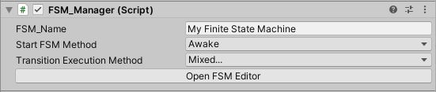
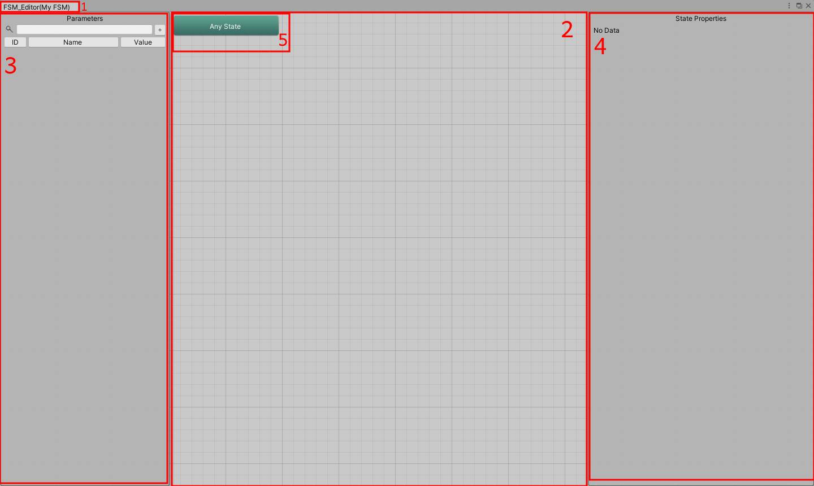

# FSM Manager component overview
The FSM Manager is responsible for managing the state transitions and executing their behaviours. To create a Finite State Machine you must add this component to a GameObject and define some properties in the inspector tab.

| Name | Description |
| ---- | ----------- |
| FSM_Name | The name of the Finite State Machine. This is oly for organization purposes and does not affect any behaviour of the component. |
| Start FSM Method | Unity Monobehaviour method where the FSM_Manager setup will be called. |
| Transition Execution Method | The Monobehaviour method(s) where transtions will be verified and executed. You can select more than one option. |

To open the node editor, just click the **Open FSM Editor** button in the FSM Manager inspector.

1. The Finite State Machine name is shown in the window title.
2. States area.
3. Parameters area.
4. State properties area.
5. "Any State" block.

In this window you define all states, transitions and parameters that control the machine. I explain more about this window in the [next section](States-Parameters-Transitions.md).