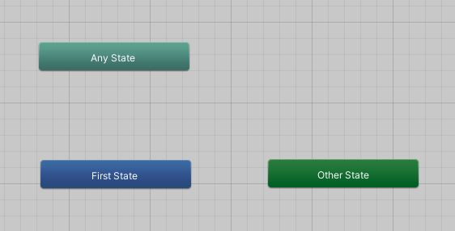
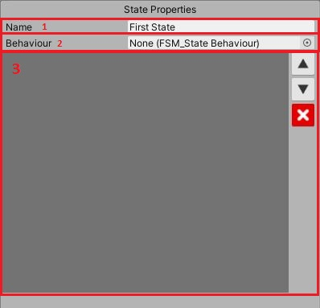
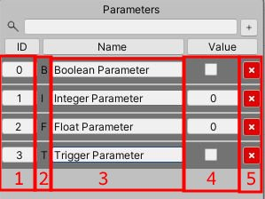
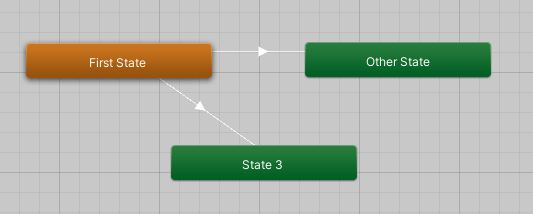
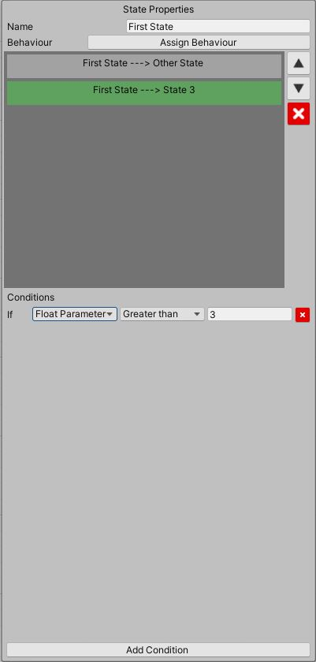

# States, parameters and transitions
## States
In a Finite State Machine, a state is a situation in the system that is waiting to execute a transition. Here, the machine is always in one state and never in more than one.

The default state, in blue, is the first state assumed when the system is started. You can define the default state by right-clicking on a state block and selecting "Set as Default State".

When you select a state, the State Properties area shows all the state properties and the selected state block turns orange.

1. State name field.
2. State behaviour field.
3. State transitions area.

## Parameters
In parameters area, we can define all the parameters that will control our machine. You can create parameters of the following types:

| Name | Description |
| ---- | ----------- |
| Boolean | Can assume the values **True** or **False** |
| Integer | Can assume integer number values |
| Float | Can assume float number values |
| Trigger | Can be set to **True** and will become **False** automatically when a transition occurs |

1. Parameter ID field. Change this value to reorder the parameters.
2. Parameter type indicator.
3. Parameter name field.
4. Parameter value field.
5. Delete parameter button.

## Transitions
To make our machine changes its state we have to create transitions. A transition is a one-way connection between two states A and B. When the machine is in state A and the transition conditions are satisfied, the machine moves to the state B.
You can create a transition by right-clicking on a state block and selecting "Create Transition".

When a state is selected, you can see all its transitions listed in the State Properties area and set the conditions under which a transition occurs.

Now, you can set up a Finite State Machine. In the [next section](Creating-State-Behaviour.md), you will learn how to code a State Behaviour and set the machine parameters at runtime.